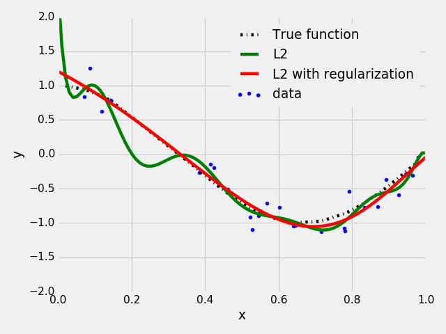

# General Norm Approximation Solver

written by Yasuyuki Matsushita (yasumat@ist.osaka-u.ac.jp) at Osaka University.

### What is Norm Approximation?

In various scientific computing tasks, there arises a need for minimizing some vector norm, 
or a combination of different vector norms. A generalized norm approximation problem can be written as


where  is the term index, 

and 

are the design matrix and vector that define the 
-th objective. 
The overall objective function is defined as a linear combination of 
-th power of 
-norm weighted by 
. The goal is to determine 
. 
This software package provides a solution method for this problem.


For example, in compressive sensing, 
an unconstrained form of Lasso (least absolute shrinkage and selection operator) can be written as


which corresponds to the case where
 and

 in the general form described above.
 
As another example, Tikhonov regularization or ridge regression that appears in image restoration, super-resolution, 
and image deblurring can be written as
 
.
 
This case corresponds to the case where
 and 
.
 
These objective functions can be further augmented by additional 
-norm terms that represent constraints.
For example, elastic net is defined as
 

 
which corresponds to   and 
.

This implementation can take arbitrary numbers of norm terms, each of them is linear but can have different norm, constraint matrix, and vector. 
### How to use?

Call a function ``solve`` defined in ``normapprox.py`` by appropriately forming matrices 
 and 
vectors  as well as 
lists of weights 
and norm specifiers  in the form of python lists, and 
pass them to ``A_list``, ``b_list``, ``lambda_list``, and ``p_list``, respectively. 

```
def solve(A_list=None, b_list=None, lambda_list=None, p_list=None, max_iter=10000, tol=1.0e-8):
```

See examples for more.

### Example 1: Polynomial fitting with regularization - ex01.py

We take an example of polynomial fitting. Suppose we have data points in the x-y plane and wish to fit 
a polynomial function of degree  to the data points:


Here parameters to estimate are coefficients 
.
This problem can be written in a matrix form by a proper matrix 
 and a vector
, as 
 
(See ``ex01.py`` for how  
and  are formed).
The goal is to estimate a *good*  that best approximates the equality.
For example, with an L2 metric, this can be formulated as:

Conventional least-squares regression (Case 1): 


<BR>
 
Over-fitting is a common issue in this type of problems when a proper polynomial degree is unkonwn. 
A conventional approach to avoiding this issue is to *regularize* the esimates by some additional constraints. 
This example penalizes the estimates that have high values using a *regularizer*:

Least-squares regression with a regularizer (Case 2):
,
where 
 in this particular example.

<BR>

These problems Case 1 and Case 2 can be solved by the following code:


    import normapprox as na
    ...
    # Case 1: Conventional least-squares fitting
    w1, residue1, ite1 = na.solve(A_list=[A], b_list=[b], lambda_list=[1], p_list=[2])
    # Case 2: Least-squares fitting with L2 regularization (special form of Ridge regression)
    w2, residue2, ite2 = na.solve(A_list=[A, np.identity(n)], b_list=[b, np.zeros(n)],
                                  lambda_list=[1, 1e-4], p_list=[2, 2])


Below shows the result of Case 1 and Case 2 fittings. With a regularizer (Case 2), it can be seen that the issue of
over-fitting is alleviated.

 
 
### Conditions of use

This package is distributed under the GNU General Public License. For
information on commercial licensing, please contact the authors at the
contact address below. If you use this code for a publication, please cite the following paper:

    @inproceedings{FGNA2016,
	  	title={Fast General Norm Approximation via Iteratively Reweighted Least Squares},
	  	author={Masaki Samejima and Yasuyuki Matsushita},
	  	booktitle={Proceedings of Asian Conference on Computer Vision Workshops (ACCVW)},
	  	year={2016}
	}

### Dependencies
The code is written in Python 3.6 but should be able to adapt it to Python 2.x if needed.
You might need the following Python packages installed:
* `numpy` (main computation depends on matrix operations)
* `matplotlib` (for running example codes, but not used in the main computation code)


### Contact information

Questions / Comments? Bug reports? Please contact Yasuyuki Matsushita at yasumat@ist.osaka-u.ac.jp.


